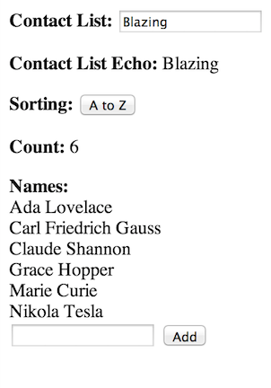
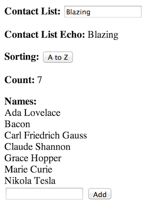
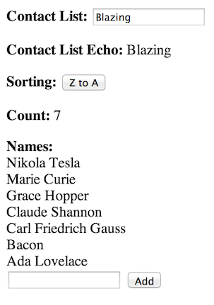

# Using Bacon and Vue to implement reactive components

Modified example from: http://codepen.io/imslavko/pen/KhAyp .

 

 

```
<head>
    <script type='text/javascript' src="http://vuejs.org/js/vue.min.js"></script>
    <script src="//code.jquery.com/jquery-1.9.0.min.js"></script>
    <script src="http://rawgithub.com/baconjs/bacon.js/master/dist/Bacon.min.js"></script>
    <script src="http://rawgithub.com/baconjs/bacon.model/master/dist/bacon.model.min.js"></script>

    <script type="text/vue" id="template">
        <p><b>Contact List:</b> <input type="text" id="list-name" v-on="keyup: listNameChange"/></p>
        <p><b>Contact List Echo: </b> {{model.listName}}</p>
        <p><b>Sorting:</b> <button id="toggle-order" v-on="click: toggleOrder">{{order()}}</button></p>

        <p><b>Count: </b>{{model.names.length}}</p>

        <b> Names:</b>
        <div v-repeat="c: contacts()">{{c}}</div>

        <!--<form>-->
            <input type="text" id="new-contact" v-on="keyup: submit | key 13">
            <input type="submit" value="Add" v-on="click: addName">
        <!--</form>-->

        <br>
        <input type="checkbox" id="check1"  v-model="checked()" v-on="change: checkChange">

        <input type="checkbox" id="check2"  v-model="checked()" v-on="change: checkChange">
    </script>

    <script>

        function sorted(arr, asc) {
            var cloned = arr.slice(0);
            cloned.sort(); // sort in-place
            if (!asc)
                cloned.reverse(); // reverse in-place
            return cloned;
        }
        ;

        function binder(component, name, type) {
            return function (ev) {
                var val = null;
                if (type === "switch") {
                    val = $(ev.target).is(":checked");
                }
                else if (type === "enter" && ev.keyCode === 13) {
                    val = $(ev.target).val();
                }
                if (val == null) {
                    val = $(ev.target).val();
                }
                component.set(name, val);
            }
        }

        function componentFactory() {
            var model = new Bacon.Model({
                check: false,
                ascending: true,
                names: ["Carl Friedrich Gauss", "Marie Curie",
                    "Grace Hopper", "Claude Shannon",
                    "Ada Lovelace", "Nikola Tesla" ]
            });
            return {
                model: model,
                set: function (name, val) {
                    model.lens(name).set(val);
                },
                toggleOrder: function () {
                    model.lens("ascending").set(!model.get().ascending);
                },
                addName: function (newName) {
                    var allNames = model.get().names;
                    console.log("NEW NAME", newName);
                    model.lens("names").set(allNames.concat([newName])); // update the data model
                }
            }
        }
        ;

        function viewFactory(component) {
            var model = component.model;

            var m = {model: model.get()};

            model.log().onValue(function (val) {
                m.model = val;
            });

            return {
                m: m,
                helpers: {
                    model: function () {
                        return model.get();
                    },
                    order: function () {
                        return model.get().ascending ? 'A to Z' : 'Z to A';
                    },
                    contacts: function () {
                        return sorted(model.get().names, model.get().ascending);
                    },
                    checked: function () {
                        return model.get().check ? "checked" : ""
                    },

                    toggleOrder: function () {
                        component.toggleOrder();
                    },
                    addName: function (e) {
                        component.addName($("#new-contact").val());
                        $('#new-contact').val('');
                        return false;
                    },
                    listNameChange: binder(component, "listName"),
                    checkChange: binder(component, "check", "switch")
                }
            }
        }
        ;
    </script>
</head>

<body>
    <div id='container'>
    </div>

    <script>

        var component = componentFactory();
        var viewModel = viewFactory(component);

        var view = new Vue({
            el: '#container',
            template: "#template",
            data: viewModel.m,
            methods: viewModel.helpers
        });

    </script>
</body>

```